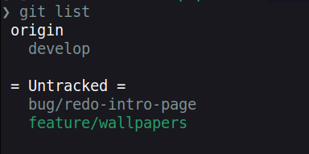
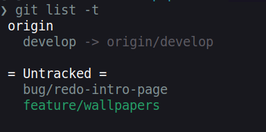
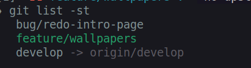

# git-list - A Custom Git Extension

The `git-list` is a custom Git extension, developed in C/C++, that provides additional information about the local branches.

Its main feature is to display branches showing the tracked remote in a simple effecient interface.
It also displays the current state of the branch including if there is a current WIP commit.


## Why C++ and not Shell scripts
I originally wrote this in a shell script but because of the multiple git calls, it ran slowly. So moving to libgit2, I was able to perform multiple actions much faster than using scripts.

I will hopefully be porting most of my productivity commands to cpp over time as part of my GitReal project.

Example output

#### Default List
The default output will group the branches locally, by their remote.
If a local branch does not track a remote branch then it will be listed below all other branches.

```sh
> git list
```



#### Tracked Branches
By default the command will group branches by the remote, in most cases this is enough information as we usually track to a branch of the same name.

However if you want to se the tracked branch name, pass the  -t flag.

```sh
> git list -t
```



#### Simple List
The -s will show a simplified list simimalr to `git branch` Below is an example of -s with the -t option

```sh
> git list -s
```



#### WIP Commit
If you use WIP commits, the -w will show you which branches have a current WIP commit.

```sh
> git list -w
```


#### CLI Commands
    git-list <OPTIONS>


##### Build
cd into the git-list dir and run `make`

This will build both the binary and the debian package `src/git-list/package/git-list.deb` file.
You can then install as per usual.
